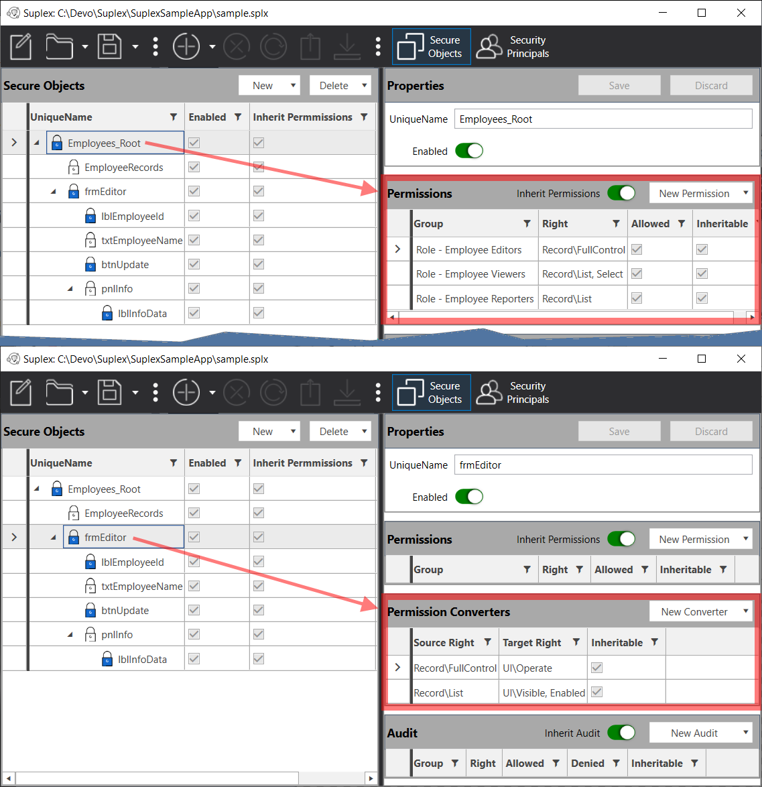

# Deep Dive on the SampleApp

This document describes the QuickStart SampleApp in detail, including code, the Suplex admin UI, and how to manipulate values for testing different security scenarios.  The code and executables described within can be found at the locations below:

- <a href="https://github.com/SuplexProject/Suplex.UI.Wpf/releases" target="_blank">Suplex WPF UI</a> for editing Suplex FileStore files
- <a href="https://github.com/SuplexProject/Suplex.Sample" target="_blank">Source code</a> for the SampleApp
- <a href="https://github.com/SuplexProject/Suplex.Sample/releases" target="_blank">Build</a> for the SampleApp

## Overview and Assumptions

The SampleApp is a simple, single-dialogue, WinForms app, with a few features designed to simulate real-World scenarios common to RBAC security concerns. One upfront assumption: you're probably a better WinForms developer than I, and I know a few parts of the code are a less than optimal.  I built the app to be simple enough for anyone to follow, but I'm happy to take a pull request if there are useful suggestions for improvement.

A high-level overview of the construction is as follows: the main application is a single dialog, split into two parts.

1. Top portion, above the red, dashed line, is for selecting a Suplex FileStore file (*.splx) and then subsequently selecting a "runtime user context," which is meant to simulate a new user "logging in" to the app.  The 'Refresh Suplex Now' button supports loading a new Suplex FileStore into memory if you manually edit the file path.  Otherwise, the FileStore is loaded/refreshed from the File | Browse action.

2. The bottom portion, below the red, dashed line, shows the behaviour of the "client application" (client area) for a given user context (as selected from the dropdown above).  Try selecting Employee records or updating the Name value; Info/Error messages will appear as appropriate in the Messages pane.


This sample assumes you're familiar with C#, YAML, using the Suplex WPF UI, and and Suplex's philosophical approach to RBAC management.  If you need more information on these topics, visit the links below.

- [About Suplex](suplex/ "About Suplex")
- <a href="https://www.youtube.com/watch?v=FimK9o6e7l0" target="_blank">Suplex WPF UI Overview</a>
- <a href="https://yaml.org/" target="_blank">Official YAML website</a>

## Using the SampleApp

- To start using the app, run it and browse to the "sample.splx" Suplex FileStore file.
- Once it's loaded, select a User Context from the dropdown, and observe the behaviour of the client area.
- You may interact with the client area controls to further observe security behaviours.

### Manipulating Security at Runtime

An important feature of the SampleApp is its ability to dynamically reload security information and automatically refresh the dialog accordingly.  The allows you to edit security from the Suplex WPF UI and observe behavioural changes without restarting the app.  To try this out, open the sample.splx file with the Suplex WPF UI (while the SampleApp is still running) and make some changes.  You'll see the SampleApp reload the file whenever you save your changes, and the dialog will update accordingly.


## Code Review

The code is functionally divided into 4 main parts:

1. <a href="#1-connectingrefreshing-the-filestore">Connecting-to and refreshing-from the Suplex FileStore file (sample.splx)</a>
2. <a href="#2-connectingrefreshing-the-employeedal">Connecting-to and loading the "Employee Data Access Layer"</a>
3. <a href="#3-applying-security-to-the-client-area">Applying security to the client area</a>
4. <a href="#4-handling-client-area-actions">Handling client area actions</a>

### 1. Connecting/Refreshing the FileStore

**Code highlights**: This code is supports loading the Suplex FileStore file and refreshing the dialogue if the file changes (presumably from the Suplex WFP UI).  Note the FileSystemWatcher for the auto-refresh; it will attempt 5 tries for ~.5sec, but won't throw an exception if it can't reload the file.  The `RefreshSuplex` method initializes the Suplex FileSystemDal (`_suplexDal`) and resets the dialog.

```c#
/// <summary>
/// Initializes a file watcher on the Suplex file store; refreshes the dialog when the file changes
/// </summary>
/// <param name="filestorePath">The path to a Suplex FileStore</param>
void InitFileConnection(string filestorePath)
{
    string folder = Path.GetDirectoryName( filestorePath );
    string file = Path.GetFileName( filestorePath );
    _filestoreWatcher = new FileSystemWatcher( folder, file );
    _filestoreWatcher.Changed += FilestoreWatcher_Changed;
    _filestoreWatcher.EnableRaisingEvents = true;

    //Initial data load
    RefreshSuplex( filestorePath );
}

/// <summary>
/// Attempts to open the file and refresh the dialog.
/// </summary>
void FilestoreWatcher_Changed(object sender, FileSystemEventArgs e)
{
    int attempts = 0;
    while( attempts++ < 5 )
        try
        {
            RefreshSuplex( e.FullPath );
            break;
        }
        catch { System.Threading.Thread.Sleep( 100 ); }
}

/// <summary>
/// Loads the specified file into a Suplex FileSystemDal and refreshes the dialog
/// </summary>
/// <param name="filestorePath"></param>
void RefreshSuplex(string filestorePath)
{
    _suplexDal = FileSystemDal.LoadFromYamlFile( filestorePath );
    _employeeDal = new EmployeeDataAccessLayer( _suplexDal );

    this.UiThreadHelper( () => lstMessages.Items.Clear() );
    this.UiThreadHelper( () => cmbUsers.DataSource =
        new BindingSource( _suplexDal.Store.Users.OrderBy( u => u.Name ).ToList(), null ).DataSource );
}
```
<a href="#code-review">Back to Code Review ToC</a>

### 2. Connecting/Refreshing the EmployeeDal

**Code highlights**:  The `RefreshSuplex` method above additionally initializes the EmployeeDataAccessLayer (`_employeeDal`), passing in a reference to the Suplex FileSystemDal  (`_suplexDal`).  When the method binds the _suplexDal.Store.Users list to the cmbUsers combobox, the dialogue handles reload withe `cmbUsers_SelectedIndexChanged` method and subsequently calls `RefreshEmployeesList()`.  Note the `try/catch` wrapping the `_employeeDal.GetEmployees()` call -- this is to handle the chosen implementation within the EmployeeDal that a rights-error will throw a System.Exception.

```c#
/// <summary>
/// Simulates switching the current security context
/// </summary>
private void cmbUsers_SelectedIndexChanged(object sender, EventArgs e)
{
    string currentUser = ((User)cmbUsers.SelectedItem).Name;

    //set the "current user" on the Employees DAL
    _employeeDal.CurrentUser = currentUser;

    //refresh the Employees list based on "currentUser"
    RefreshEmployeesList();

    //... code trimmed for brevity
}

private void RefreshEmployeesList()
{
    try
    {
        lstEmployees.DisplayMember = "Name";
        lstEmployees.Items.Clear();
        List<Employee> employees = _employeeDal.GetEmployees()?.OrderBy( emps => emps.Name ).ToList();
        if( employees != null )
            foreach( Employee employee in employees )
                lstEmployees.Items.Add( employee );

        lstMessages.Items.Insert( 0, $"Info : Retrieved {employees?.Count ?? 0} Employee records." );
    }
    catch( Exception ex )
    {
        lstMessages.Items.Insert( 0, $"Error: {ex.Message}" );
    }
}
```

**Code highlights, continued, EmployeeDal**:  As mentioned above, EmployeeDal methods throw a System.Exception on security rights failures.  This is an implementation choice -- the critical code is `GetByTypeRight( {RecordRight} ).AccessAllowed`, which examines the requested right and returns a boolean allowed/denied value.  All of the EmployeeDal methods take a similar form to `GetEmployees`, as shown below -- each executes `HasAccessOrException( {RecordRight} )` as the first step, continuing on to the true method action on success.

```c#
/// <summary>
/// Utility method to validate security access for a given right on Employee records
/// </summary>
/// <param name="recordRight">The right for which to validate access</param>
void HasAccessOrException(RecordRight recordRight)
{
    //Look up security information by SecureObject->UniqueName => "EmployeeRecords" for the CurrentUser
    SecureObject employeeSecurity =
        (SecureObject)_suplexDal.EvalSecureObjectSecurity( "EmployeeRecords", CurrentUser );

    //Assess AccessAllowed, throw Exception if no rights
    if( !employeeSecurity?.Security.Results.GetByTypeRight( recordRight ).AccessAllowed ?? true )
        throw new Exception( $"{CurrentUser} does not have rights to {recordRight} Employee records." );
}

/// <summary>
/// Get the Employees list
/// </summary>
/// <param name="filter">Optional Name filter</param>
/// <returns>All or matching Employees</returns>
public List<Employee> GetEmployees(string filter = null)
{
    //Check for access rights, throws exception if denied
    HasAccessOrException( RecordRight.List );

    if( !string.IsNullOrWhiteSpace( filter ) )
        return _employees.FindAll( e => e.Name.Contains( filter ) );
    else
        return _employees;
}
```

**Alternate HasAccess Implementation**: Another choice would be to simply return the boolean allowed/denied value back to the calling function, thus providing local control of rights failures.

```c#
/// <summary>
/// Utility method to validate security access for a given right on Employee records
/// </summary>
/// <param name="recordRight">The right for which to validate access</param>
bool HasAccess(RecordRight recordRight)
{
    //Look up security information by SecureObject->UniqueName => "EmployeeRecords" for the CurrentUser
    SecureObject employeeSecurity =
        (SecureObject)_suplexDal.EvalSecureObjectSecurity( "EmployeeRecords", CurrentUser );

    //Assess AccessAllowed
    return employeeSecurity?.Security.Results.GetByTypeRight( recordRight ).AccessAllowed ?? false;
}
```

<a href="#code-review">Back to Code Review ToC</a>

### 3. Applying Security to the Client Area

**Code highlights**:  Continuing through `cmbUsers_SelectedIndexChanged`, the method calls `_suplexDal.EvalSecureObjectSecurity`, passing "frmEditor" as the contextual UniqueName reference.  This will load and calculate the resultant security, then pass a reference to the returned SecureObject to the recursive extension method `static void ApplySecurity(this Control control, ISecureObject secureObject)`.  This method further examines the children of the reference SecureObject via the `FindChild<ISecureObject>( control.Name )` method call.  For each child found in the SecureObject.Children collection, the method applies the relevant settings.

Note the function only examines UIRights (`Results.ContainsRightType( typeof( UIRight ) )`) -- this is an implementation choice that follows Suplex best-practice security administration usage of AceConverters.  The image below the code shows the RecordRight permissions on the Employees_Root object, which are inherited by frmEditor and subsequently converted to UIRight permissions based on the resultant security of the current user context.

```c#
private void cmbUsers_SelectedIndexChanged(object sender, EventArgs e)
{
    string currentUser = ((User)cmbUsers.SelectedItem).Name;

    //... code trimmed for brevity

    //Evaluate the security information, starting from the top-most control
    SecureObject secureObject =
        (SecureObject)_suplexDal.EvalSecureObjectSecurity( "frmEditor", currentUser );

    //apply security to frmEditor/children
    ApplyRecursive( secureObject );
}

/// <summary>
/// Recursively examines frmEditor and its children for applying security; see UIExtensions
/// </summary>
/// <param name="secureObject">The matching SecureObject to frmEditor</param>
void ApplyRecursive(SecureObject secureObject)
{
    frmEditor.ApplySecurity( secureObject );
}

//see UIExtensions.cs
public static void ApplySecurity(this Control control, ISecureObject secureObject)
{
    if( secureObject == null )
    {
        control.Visible = false;
        return;
    }

    ISecureObject found =
        secureObject.UniqueName.Equals( control.Name, StringComparison.OrdinalIgnoreCase ) ?
        secureObject : secureObject.FindChild<ISecureObject>( control.Name );

    if( found != null && found.Security.Results.ContainsRightType( typeof( UIRight ) ) )
    {
        control.Visible = found.Security.Results.GetByTypeRight( UIRight.Visible ).AccessAllowed;
        control.Enabled = found.Security.Results.GetByTypeRight( UIRight.Enabled ).AccessAllowed;
        if( control is TextBox textBox )
            textBox.ReadOnly = !found.Security.Results.GetByTypeRight( UIRight.Operate ).AccessAllowed;
    }

    if( control.HasChildren )
        foreach( Control child in control.Controls )
            child.ApplySecurity( secureObject );
}
```

**AceConverters for RecordRights->UIRights**:



<a href="#code-review">Back to Code Review ToC</a>

### 4. Handling Client Area Actions

**Code highlights**: Each of the client area actions takes a similar shape to below, where a try/catch wraps a call to the EmployeeDal.  As mentioned above, it's an implementation choice to throw exceptions from the EmployeeDal on rights errors: if choosing the alternate `bool HasAccess()` method, consumer implementation could then conceivably omit the try/catch in favor of null-checking the result.  See the alternate example code snippet below.

**Chosen HasAccess Method - Throw Exception on Denied**:

```c#
private void RefreshEmployeesList()
{
    try
    {
        lstEmployees.DisplayMember = "Name";
        lstEmployees.Items.Clear();
        List<Employee> employees = _employeeDal.GetEmployees()?.OrderBy( emps => emps.Name ).ToList();
        if( employees != null )
            foreach( Employee employee in employees )
                lstEmployees.Items.Add( employee );

        lstMessages.Items.Insert( 0, $"Info : Retrieved {employees?.Count ?? 0} Employee records." );
    }
    catch( Exception ex )
    {
        lstMessages.Items.Insert( 0, $"Error: {ex.Message}" );
    }
}

/// <summary>
/// Get the Employees list
/// </summary>
/// <param name="filter">Optional Name filter</param>
/// <returns>All or matching Employees</returns>
public List<Employee> GetEmployees(string filter = null)
{
    //Check for access rights, throws exception if denied
    HasAccessOrException( RecordRight.List );

    if( !string.IsNullOrWhiteSpace( filter ) )
        return _employees.FindAll( e => e.Name.Contains( filter ) );
    else
        return _employees;
}
```

**Alternate HasAccess Method - Return <_null_> on Denied**:

```c#
private void RefreshEmployeesList()
{
    lstEmployees.DisplayMember = "Name";
    lstEmployees.Items.Clear();
    List<Employee> employees = _employeeDal.GetEmployees()?.OrderBy( emps => emps.Name ).ToList();
    if( employees != null )
    {
        lstMessages.Items.Insert( 0, $"Info : Retrieved {employees?.Count ?? 0} Employee records." );
        foreach( Employee employee in employees )
            lstEmployees.Items.Add( employee );
    }
    else
    {
        lstMessages.Items.Insert( 0, $"Error: {ex.Message}" );
    }
}

/// <summary>
/// Get the Employees list
/// </summary>
/// <param name="filter">Optional Name filter</param>
/// <returns>All or matching Employees</returns>
public List<Employee> GetEmployees(string filter = null)
{
    //Check for access rights, return <null> if denied
    if( !HasAccess( RecordRight.List ) )
        return null;

    if( !string.IsNullOrWhiteSpace( filter ) )
        return _employees.FindAll( e => e.Name.Contains( filter ) );
    else
        return _employees;
}
```

<a href="#code-review">Back to Code Review ToC</a>

## Security Configuration - Users, Groups, and Roles

The SampleApp RBAC configuration follows Suplex best-practice separation of "User-groups" and "Role-groups" -- the distinction being that User-groups are typically aligned to natural business functions, such as workgroups/teams, and Role-groups are aligned to application control requirements.  In the SampleApp, all the groups a "local" (Suplex proprietary), meaning you can edit group membership.  Most commonly, User-groups are sourced from an external provider, such as an LDAP store like ActiveDirectory.  In the setup, Users/User-groups are members of User-groups, User-groups are members of Role-groups, and Role-groups are permissioned to SecureObjects.

Note that some users are disabled -- this is to show the result at the consumer where, in the course of business, users may need to be prevented from gaining access to protected resources.  Disabling a user or group will prevent all access the SecurityPrincipal is otherwise afforded.


## Security Configuration - SecureObjects and Aces

Following Suplex best practices further, few permissions are implemented _directly_.  The SampleApp is notionally oriented toward managing Employee records, which is largely governed by rights to access and modify said records.  As such, permissions are applied at the Employees_Root object and then inherited and converted down the tree.  Revisiting the screenshot from above, note that RecordRights from Employees_Root are converted at the point of consumption to required UIRights.  AceConverters use the resultant security for the source permissions, meaning, whatever RecordRights the user ends up with at runtime, independent of Role, will be converted to a UIRight and applied accordingly.


