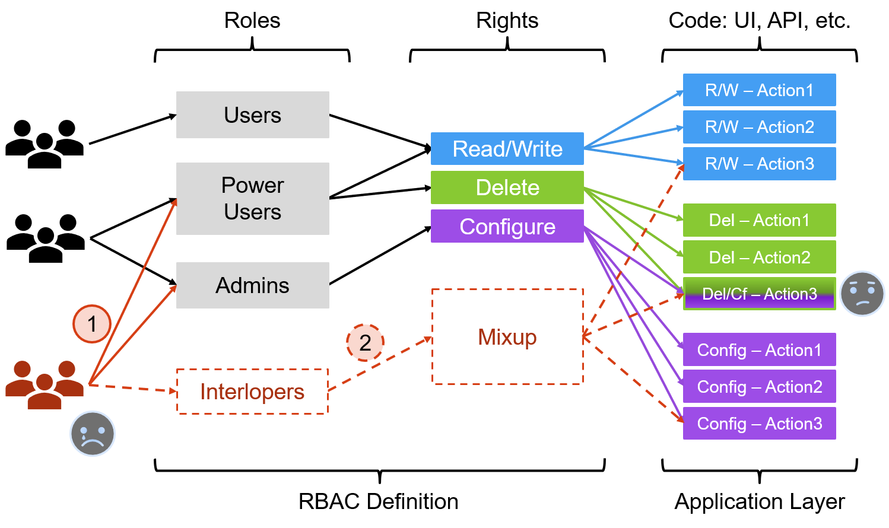
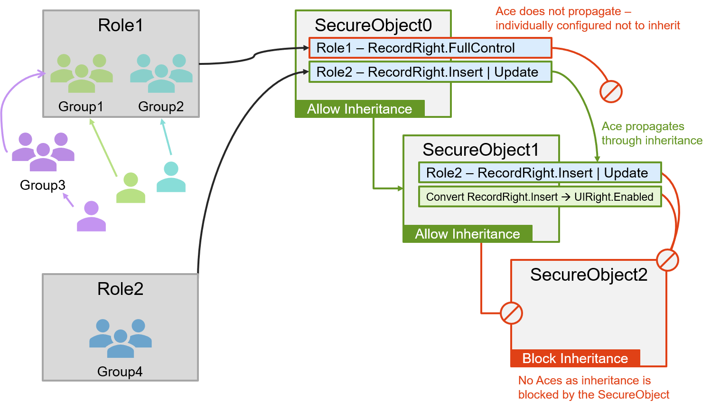

# Using Suplex for RBAC Design

## Why Suplex?

Role Based Access Control (RBAC) is neither new nor exciting, but solid, reliable security design is critical for almost all applications.  Suplex evolves RBAC design by _securing by concept_ and pushing the application security implementation to config, thereby introducing abstraction and extensibility patterns.

I wrote Suplex because I got tired of copy/pasting code into similar (but always a _little_ different) proprietary RBAC models for each new application, and I also wanted to make security administration easier over the lifetime of an application.

Suplex change history:

 - 2001 - 2004: First draft
 - 2004 - 2007: Better, more-complete
 - 2007 - 2018: Open-sourced in 2007, code stable, only bug-fixes until 2018
 - 2018 - present: streamlined, easier to use, .netcore-compatible
 
 In the latest release, the code is clean and the patterns are well-defined, and my hope is it's easy to plug Suplex into any application without much effort.

<h1>Traditional RBAC v Securing by Concept</h1>

## Traditional RBAC: Roles & Rights

A traditional RBAC is is typically *Users/Groups => Role => Right*, where Rights are defined in application-specific ideas and implemented in matching code blocks.  The drawback to this approach is one must understand all possible security profiles before coding, or the Rights must be sufficiently granular to accommodate unforseen and anomalous profiles.  As developers, we'll probably choose granularity, but, the resultant RBAC Rights list can end up being quite large, which may confuse consumers, or just be a lot of work to maintain.  We could consolidate, but that, of course, defeats the granularity.  Another general problem is alignment of RBAC Rights definitions to code - not every code action neatly matches discreet Right definitions, thus hampering optimally granulating Rights.

In the example diagram below, the initial RBAC is defined with Rights 'Read/Write', 'Delete', and 'Configure', mapped to corresponding code actions, and there's only one bit of shared-Rights-code where the 'Delete' and 'Configure' actions overlap.  As developers, a small if-clause on the top of the shared code is not ideal, but we're probably only slightly unhappy.

#### Example Code: Checking RBAC Access

```c#
//Validating access by Role Membership
if( User.IsInRole("Power Users") || User.IsInRole("Admins") )
{
  //do some work
}

//Validating access with a Rights Check
if( User.HasRight("Delete") || User.HasRight("Configure") )
{
  //do some work
}
```

The real problem doesn't come until later, when an anomalous Role request comes about - 'Interloper' - which requires defining an unforseen 'Mixup' that pulls together a little of 'Read/Write', a little 'Delete', and a little 'Configure'.  Options for handling that:

- **Option 1**: Grant users access to 'Power Users' and 'Admins'.  That works, but it provides greater access than desired.  When an anomalous request arrives, this is often the chosen solution.
- **Option 2**: Program a new Role ('Interlopers') that properly defines the new Right ('Mixup').  This requires code maintenance, regression testing, documentation, and more.
- **Both options** make us sad because we either grant too much privilege or have weird RBAC code, and we can predict it's only going to get worse, which makes us sadder still.



## Suplex RBAC: Hierarchical, Inherited ACLs & Nested Security Principals

Getting right to it:

1. Suplex mimics certain aspects of directory and file system security patterns, where a hierarchy of objects have permissions applied, and those permissions may be inherited to descendant objects in the tree,

2. Suplex implements permissions by logical Right-concepts, not directly related to application function,

3. Suplex Roles are constructed of aggregate sets of logical Rights,

4. Suplex Role membership can be flat Users->Groups or nested Users->[Group->...]Group->Roles.

The diagram below shows a sample implementation, and following are the various elements, decomposed and explained.



#### Example Code: Evaluate Security

```c#
//Calculate SecurityResults for the object hierarchy (start at the top)
secureObject0.EvalSecurity();

//Assess 'AccessAllowed' (bool) for the desired object
secureObject1.Security.Results.GetByTypeRight( RecordRight.Insert ).AccessAllowed;
```

## Securing by Concept

As mentioned above, traditional RBAC requires one to either understand exhaustive security profiles or define high levels of Rights-granularity.  Traditional RBAC also "understands" the application in the sense that Rights are correlated to code actions in application terminology.  Suplex addresses this issue by abstracting into logical concepts that are aligned with the physical actions being executed, then defining Roles as sets of logical concepts.  As with traditional RBAC, one must still know ahead of time what things need to be secured, but the direct security implementation becomes decoupled from the application itself.  Lastly, logical, action-oriented concepts better align to code implementation.

Role construction in Suplex is accomplished by aggregating sets of logical Rights, where each role can contain any arbitrary set of rights.  Additionally, Suplex implements a hierarchical inheritance pattern to allow Rights aggregation over a series of objects, where individual Rights may be granted/denied as appropriate.

### SecureObjects and Inheritance

To accomplish this, Suplex defines a 'SecureObject', which is essentially a security topic within your application.  The SecureObject could be an actual object (instantiated class), or a "container" (a logical representation only).  SecureObjects host a SecurityDescriptor which contains a list of permissions, known as AccessControlEntires (Aces), where Aces are the Rights that are granted/denied to SecurityPrincipals (users/groups).  SecurityDescriptors control Ace propagation in the inheritance model, and individual Aces can define their own inheritance settings, as well.

To better understand inheritance, consider the following diagram, taking a simple SecureObject hierarchy and two Suplex conceptual Rights, 'UIRight.Enabled' and 'RecordRight.Insert'.  In the example:

- The UIRight.Enabled permission is individually configured not to inherit, therefore applies only to SecureObject_0.
- The RecordRight.Insert permission propagates from SecureObject_0 to SecureObject_1, but does not further propagate to SecureObject_2 as SecureObject_2 specifically blocks inheritance. 

<p align="center">

</p>


- UIRight { FullControl, Operate, Enabled, Visible }
- RecordRight { FullControl, Delete, Update, Insert, Select, List }