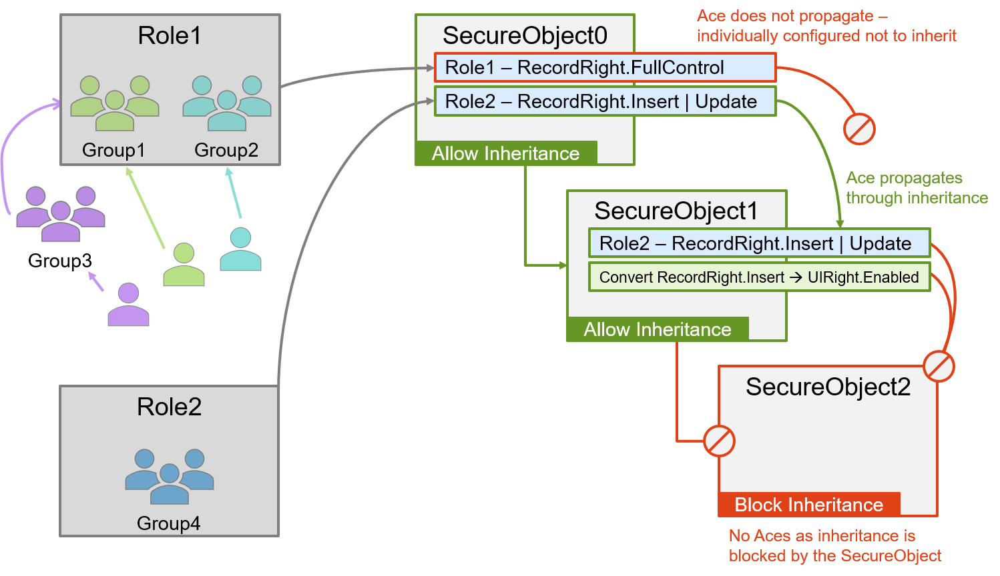

# Using Suplex for RBAC Design

## Why Suplex?

Role Based Access Control (RBAC) is neither new nor exciting, but solid, reliable security design is critical for almost all applications.  Suplex evolves RBAC design by _securing by concept_ and pushing the application security implementation to config, thereby introducing abstraction and extensibility patterns.

I wrote Suplex because I got tired of copy/pasting code into similar (but always a _little_ different) proprietary RBAC models for each new application, and I also wanted to make security administration easier over the lifetime of an application.  The first draft of Suplex began in 2001 and I "finished" it in 2007.  Since then, and until the most recent (heavily streamlined) release, I've found the model to be accommodating and successful.

<h1>Traditional RBAC v Securing by Concept</h1>

## Traditional RBAC: Roles & Rights

A traditional RBAC is typically *Users/Groups => Roles => Rights*, where Rights are defined in application-specific ideas and implemented in matching code blocks.  The drawback to this approach is one must understand all possible security profiles before coding, or the Rights must be sufficiently granular to accommodate unforseen and anomalous profiles.  As developers, we'll probably choose granularity, but, the resultant RBAC Rights list can end up being quite large, which may confuse consumers, or just be a lot of work to maintain.  We could consolidate, but that, of course, defeats the granularity.  Another general problem is alignment of RBAC Rights definitions to code - not every code action neatly matches discreet Right definitions, thus hampering optimally granulating Rights.

In the example diagram below, the initial RBAC is defined with Rights 'Read/Write', 'Delete', and 'Configure', mapped to corresponding code actions, and there's only one bit of shared-Rights-code where the 'Delete' and 'Configure' actions overlap.  As developers, a small if-clause on the top of the shared code is not ideal, but we're probably only slightly unhappy.

#### Example Code: Checking RBAC Access

```c#
//Validating access by Role Membership
if( User.IsInRole("Power Users") || User.IsInRole("Admins") )
{
  //do some work
}

//Validating access with a Rights Check
if( User.HasRight("Delete") || User.HasRight("Configure") )
{
  //do some work
}
```

The real problem doesn't come until later, when an anomalous Role request comes about - 'Interloper' - which requires defining an unforseen 'Mixup' Role that pulls together a little of 'Read/Write', a little 'Delete', and a little 'Configure'.  Options for handling that:

- **Option 1**: Grant users access to 'Power Users' and 'Admins'.  That works, but it provides greater access than desired.  When an anomalous request arrives, this is often the chosen solution.
- **Option 2**: Program a new Role ('Interlopers') that properly defines the new Right ('Mixup').  This requires code maintenance, regression testing, documentation, and more.
- **Both options** make us sad because we either grant too much privilege or have weird RBAC code, and we can predict it's only going to get worse, which makes us sadder still.


## Suplex RBAC: Hierarchical, Inherited ACLs & Nested Security Principals

Getting right to it:

1. Suplex mimics certain aspects of directory and file system security patterns, where a hierarchy of "SecureObjects" have permissions applied, and those permissions may be inherited to descendant objects in the tree,

2. Suplex implements permissions by logical Right-concepts, not directly related to application concepts,

3. Suplex Roles are constructed of aggregate sets of logical Rights,

4. Suplex Role membership can be flat Users->Groups or nested Users->[Group->...]Group->Roles.

The diagram below shows a sample implementation, and following are the various elements, decomposed and explained.



#### Example Code: Evaluate Security

```c#
//Calculate SecurityResults for the object hierarchy (start at the top)
secureObject0.EvalSecurity();

//Assess 'AccessAllowed' (bool) for the desired object
secureObject1.Security.Results.GetByTypeRight( RecordRight.Insert ).AccessAllowed;
```

# Deep-dive of Solution Architecture

**A quick Glossary and note on Casing Convention:**

- **SecurityPrincipal**: a User or Group.
- **Trustee**: a SecurityPrincipal to which a Right has been granted.
- **Role**: In Suplex, a Role is really a Group, dedicated for aggregating Rights.
- **SecureObject**: an item onto which permissions are placed.
- **UniqueName**: the human-friendly name for a SecureObject, should be unique within a discreet hierarchy.
- **SecurityDescriptor**: the physical code structure that holds permission information.
- **Ace**: Access Control Entry; a permission or audit entry in an Acl.  An Ace is a Trustee + Right.
- **Acl**: Access Control List; a list of Aces.
- **Dacl**: Discretionary Access Control List; permission Aces.
- **Sacl**: System Access Control List; audit Aces.
- **SecurityResults**: the resultant security, post-evaluation, for a given SecurityPrincipal on a SecureObject.
- **_Convention_**: Acronyms for Suplex structures, such as 'Acl', are expressed in CamelCase for readability and to bear similarity to the code base.

## Securing by Logical Concept

As mentioned above, traditional RBAC requires one to either define exhaustive security profiles or high levels of Rights-granularity.  Traditional RBAC also "understands" the application in the sense that Rights are correlated to code actions in application terminology.  Suplex addresses this issue by abstracting into logical concepts that are aligned with the physical actions being executed, then defining Roles as sets of logical concepts.  As with traditional RBAC, one must still know ahead of time what things need to be secured, but the direct security implementation becomes decoupled from application concepts.  Lastly, logical, action-oriented concepts better align to code implementation.

#### Built-in Logical Rights:

The following are the built-in logical Rights, but extending Suplex is as simple as having any enum with a Flags attribute.

- **UIRight**: { FullControl, Operate, Enabled, Visible }
- **RecordRight**: { FullControl, Delete, Update, Insert, Select, List }
- **FileSystemRight**: { FullControl, Execute, Delete, Write, Create, Read, List, ChangePermissions, ReadPermissions, TakeOwnership }
- **SynchronizationRight**: { TwoWay, Upload, Download, OneWay }

#### Example Code: Using a Logical Concept to Secure an API call.

In the example below, given the following Security layout, 'Power Users' and 'Users' are granted 'List' access.  Conceptually, 'List' is the ability to retrieve a list of records, vs 'Select', which is to retrieve a detail record (supports Master/Details scenarios).  In Ace3, the 'Viewers' role is not granted the 'list' right and will therefore fail the 'AccessAllowed' check.  However, should a SecurityPrincipal happen to also have membership in 'Power Users' or 'Users', that SecurityPrincipal would be permitted access - to prevent that, 'List' is explicitly denied to 'Viewers' in Ace4.

```yaml
SecureObjects:
- UniqueName: employeeSecurity
  Security:
    DaclAllowInherit: true
    Dacl:
      #Ace1
    - RightType: RecordRight
      Right: FullControl
      Allowed: True
      TrusteeUId: 2b9e9d66-e977-46fc-80b8-4db051c51426 #(Power Users)
      #Ace2
    - RightType: RecordRight
      Right: List, Select, Insert, Update
      Allowed: True
      TrusteeUId: ef54a62d-8026-424a-bf09-c4fc9c3deac4 #(Users)
      #Ace3
    - RightType: RecordRight
      Right: Select
      Allowed: False
      TrusteeUId: 897d97a1-ff54-405f-98f1-15dd0fdc248d #(Viewers)
      #Ace4
    - RightType: RecordRight
      Right: List
      Allowed: False  #List is explicitly denied here
      TrusteeUId: 897d97a1-ff54-405f-98f1-15dd0fdc248d #(Viewers)
```

```c#
public List<Employee> GetEmployees(string filter)
{
    //Fetch the security information by UniqueName for the currentUser, then eval
    SecureObject employeeSecurity =
        _suplexDal.EvalSecureObjectSecurity( "employeeSecurity", currentUser.Name );

    //examine the result
    if( !employeeSecurity.Security.Results.GetByTypeRight( RecordRight.List ).AccessAllowed )
        throw new Exception( "You do not have rights to list Employees." );

    //if no exception, fetch and return employees;
    return new EmployeeAdapter().GetEmployees( filter );
}
```

## AceConverters

In order to facilitate securing with concepts that match the intended action, and to avoid excessive sets of parallel security constructs, Suplex supports converting Aces from one type to another.  When using DaclConverters, at runtime, Suplex will _create a new Ace of TargetRightType.TargetRight_ for the current SecurityPrincipal and then evaluate it, where _newAce.Allowed = [resultant security for the SourceRightType.SourceRight]_.  The new Aces support inheritance settings, and as such may be propagated or not to child SecureObjects Dacls.  The code-equivalent of a DaclConverter would be:

```c#
//'this' is the current SecureObject
this.Security.Dacl.Add(
    new AccessControlEntry<{TargetRightType}>
    {
        Allowed = this.Security.Results.GetByTypeRight( {SourceRightType.SourceRight} ).AccessAllowed,
        Right = {TargetRight},
        Inheritable = true | false
    }
);
```

#### Example Code: DaclConverters

Consider the additional DaclConverters security information, as an extension to the information from the above example.  Here, the resultant security for the 'List' right is converted to UIRight.enabled, thus abstracting the record management logical concepts, and instead expressing the rights in UI logical concepts.  In keeping with general Suplex principles, the application-specific concepts that produced this result are not known.

```yaml
SecureObjects:
- UniqueName: employeeSecurity
  Security:
    DaclAllowInherit: true
    Dacl: #Aces 1..4 as shown above
    DaclConverters:
    - SourceRightType: RecordRight
      SourceRight: List
      TargetRightType: UIRight
      TargetRight: Enabled
      Inheritable: True
```

```c#
public void ApplyDialogSecurity()
{
    //Fetch the security information by UniqueName for the currentUser, then eval
    SecureObject employeeSecurity = _suplexDal.EvalSecureObjectSecurity( "employeeSecurity", currentUser.Name );

    //The DaclConverter will have converted RecordRight.List -> UIRight.Enabled
    btnGetEmployees.Enabled =
        employeeSecurity.Security.Results.GetByTypeRight( UIRight.Enabled ).AccessAllowed;
}
```

## Suplex Role Construction and Group Nesting

Role construction in Suplex is accomplished by aggregating sets of logical Rights across multiple SecureObjects, where each role can contain any arbitrary set of rights.  Roles in Suplex are really just dedicated Groups, where the function of the group is to serve as the Trustee in Aces.  Formally, Suplex doesn't know if you dedicate Groups to serve as Roles or not, but there are general best-practices that can help maintain sanity in security admin:

- Create Role-groups with a defined naming convention.  These Role-groups are typically aligned to application concepts.  Eg: 'Billing RWD', 'Billing RO', 'Billing Reports'.  Use the Role-groups as Trustees on Aces.
- Create User-groups as containers for Users or other Groups (nested Groups).  A typical implementation sources User-groups from an external provider, such as an LDAP source, like ActiveDirectory.  Add the User-groups as members of the Role-groups.  User-groups are commonly aligned to team function.
- Aggregate Rights down a SecureObject hierarchy from least-permissive rights at root nodes to most-permissive rights at leaf nodes.  This avoids accidental inheritance of overly permissive structures.
- Never create an Ace with a User SecurityPrincipal as the Trustee.  This is hard to maintain and poorly scalable.  Although Suplex supports this practice under the hood, the Suplex UI doesn't provide this edit capability.  Even if you only have one User in a Role, create the Role as a Trustee, create a User-Group and make it a member of the Role, and add the User to the User-group.  You'll thank yourself later.

## Detail on SecureObjects and Inheritance

A Suplex SecureObject is essentially a security topic within your application.  The SecureObject could be an actual object (instantiated class), or a "container" (a logical representation only).  SecureObjects host a SecurityDescriptor which contains an Acl (list of permissions, i.e. Aces), where Aces are the Rights that are granted/denied to Trustees (Groups, dedicated as Roles).  SecurityDescriptors control Ace propagation in the inheritance model, and individual Aces can define their own inheritance settings, as well.

To better understand inheritance, consider the following diagram, taking a simple SecureObject hierarchy and two Suplex conceptual Rights, 'RecordRight.FullControl' and 'RecordRight.Insert | Update'.  In the example:

- The 'RecordRight.FullControl' permission is individually configured not to inherit, therefore applies only to SecureObject0.
- The 'RecordRight.Insert | Update' permission propagates from SecureObject0 to SecureObject1, but does not further propagate to SecureObject2 as SecureObject2 specifically blocks inheritance. 

<p align="center">

</p>

### More on Inheritance and Allows, Denies

As mentioned above, the SecureObject SecurityDescriptor governs inheritance settings of the SecureObject itself, and Aces within Acls independently manage their own inheritability. Additionally, Aces carry an `InheritedFrom` property to show their origin.  The settings are:

- _secureObject.Security_.DaclAllowInherit [and] .SaclAllowInherit
- _ace_.Inheritable
- _ace_.InheritedFrom - set at runtime during Ace evaluation, the value will be:
    - <_null_> if the Ace is provisioned directly in Acl
    - the UId of the "parent" (original) Ace if inherited
    - Guid.Empty if originated via an AceConverter

Be mindful of Ace propagation as it relates to group membership.  Accidental over-permissioning may occur when a user unexpectedly exists in a Role, and that Role is given high levels of permissions on a root node in a SecureObject hierarchy.  Remember to provide the least-permissive rights at root nodes and most-permissive rights at leaf nodes.

Further, use explicit-Denies sparingly as a Deny-Ace _always overrides_ an Allow.  In general, it's best to locate Deny-Aces lower in the hierarchy and mark them with `Inheritable = false` to avoid accidental permission-blocks.

#### Example Code: Acl and Ace Inheritance Settings

```yaml
SecureObjects:
- UniqueName: employeeSecurity
  Security:
    DaclAllowInherit: true
    SaclAllowInherit: true
    Dacl:
    - RightType: RecordRight
      Right: FullControl
      Allowed: True
      TrusteeUId: 2b9e9d66-e977-46fc-80b8-4db051c51426 #(Power Users)
      Inheritable: True
    Sacl:
    - RightType: RecordRight
      Right: FullControl
      Allowed: True
      Denied: True
      TrusteeUId: 2b9e9d66-e977-46fc-80b8-4db051c51426 #(Power Users)
      Inheritable: True
```

```c#
public void SHowInheritance()
{
    //Fetch the security information by UniqueName for the currentUser, then eval
    SecureObject employeeSecurity =
        _suplexDal.EvalSecureObjectSecurity( "employeeSecurity", currentUser.Name );

    //get a reference to the SecurityDescriptor for convenience
    SecurityDescriptor sd = employeeSecurity.Security;

    //The DaclConverter will have converted RecordRight.List -> UIRight.Enabled
    Console.WriteLine( $"DaclAllowInherit: {sd.DaclAllowInherit}" );
    Console.WriteLine( $"SaclAllowInherit: {sd.SaclAllowInherit}" );
    Console.WriteLine( $"Dacl Ace Inheritable: {sd.Dacl[0].Inheritable}" );
    Console.WriteLine( $"Dacl Ace InheritedFrom: {sd.Dacl[0].InheritedFrom}" );
    Console.WriteLine( $"Sacl Ace Inheritable: {sd.Sacl[0].Inheritable}" );
    Console.WriteLine( $"Sacl Ace InheritedFrom: {sd.Sacl[0].InheritedFrom}" );
}
```

